# LabHouse Interview project: **SimpleGen**

## Project Description
Initially, I planned to complete both projects because they seemed straightforward from a functionality perspective (writing Python functions in Jupyter and sharing the notebook). However, as I progressed, I realized I wanted to go beyond just showcasing the functionality. Instead, I aimed to demonstrate my full capabilities by building a fully autonomous web application with a custom GUI, containerized and running without reliance on external APIs for generation.

Combining style transfer using SDXL + ControlNets with avatar creation through IP-Adapter or Instant-ID, while simultaneously developing a custom app containerizing it, and ensuring it met the high-quality standards I envisioned, resulted in an overly complex project. Therefore, I decided to focus solely on the style transfer aspect to ensure the delivery of a polished and functional solution.

I am deeply passionate about Geneerative AI, especially in the field of image generation, and have invested significant effort into this project to reflect my commitment and skills in this area. I truly hope this project conveys the level of dedication and expertise I bring to the table, as I am eager to contribute to the exciting advancements in Generative AI.


## Limitations
 - While using controlnets for style transfer stick to similar aspect ratio of newly generated image otherwise image crop applies.
 - NO SUPPORT FOR CPU ONLY INFERENCE!!! -> It would take hours to generate an image with it anyways..
 - From my tests you need 10-14GB of VRAM to run the inference with both Controlnets and standard image resolution 1024x1024.


## Possible Improvements (For it to become a full fledged project -> A LOT)
 - Add support for CPU only inference, however inference on CPU takes up to, well hours... depending on how many sampling steps you set.
 - Add support for separate Controlnets Conditioning Scale for different models, separate condition images, multi-image condition, Condition length (e.g. the Controlnet is applied on step 0%-80% and then the last 20% steps are pure Diffusion model to refine the image), add more customizability when it comes to Canny preprocessor, add other controlnets (like Openpose etc.)
 - Add metadata to Images concerning their generation process (for reproducibility)
 - Auto handling Image resolution for conditioning images -> no cropping -> stretching or other methods.
 - Add the Avatar generation capabilities (IP-Adapter or Instant-ID or LORA training or someone face images)...
 - Utilize Live portrait to bring Avatar images to live -> Video to condition image
 - For **production grade project** you would definitely divide the project into a proper structure: **GUI - API_GATEWAY - PIPELINE_HOSTING**  to be able to scale each component independently, ensure security, and optimize resource usage in production environments. The one-app solution that I've chosen was due to, well valuing my time.. (It was supposed to be only a task not ready product right ;)
 - Many many more...


## Showcase
Some of the style transfers made using this little tool separated on the basis on the checkpoint used -> You can find them in `Examples`

### Stable Diffusion XL 1.0 Base + controlnet (depth)

<div style="text-align: left;">
  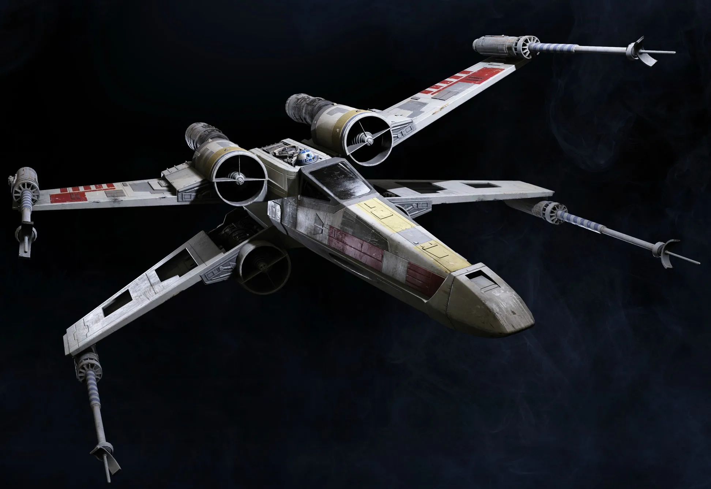
  <p style="text-align: center; width: 1200px;">Original Image</p>
</div>

<table>
  <tr>
    <td align="center">
      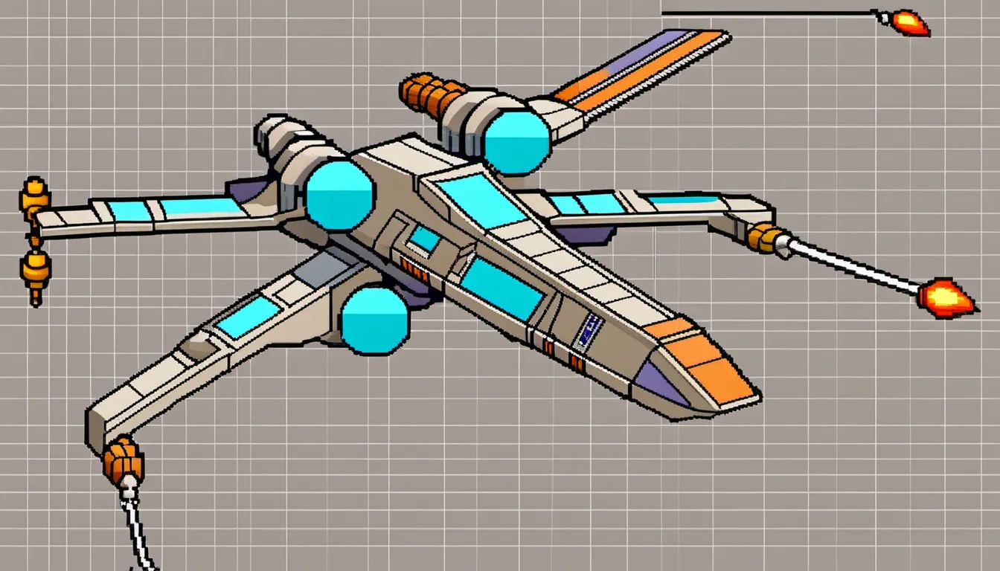<br>
      <p>Pixelart</p>
    </td>
    <td align="center">
      <br>
      <p>Steampunk</p>
    </td>
  </tr>
  <tr>
    <td align="center">
      <br>
      <p>Lowpoly</p>
    </td>
    <td align="center">
      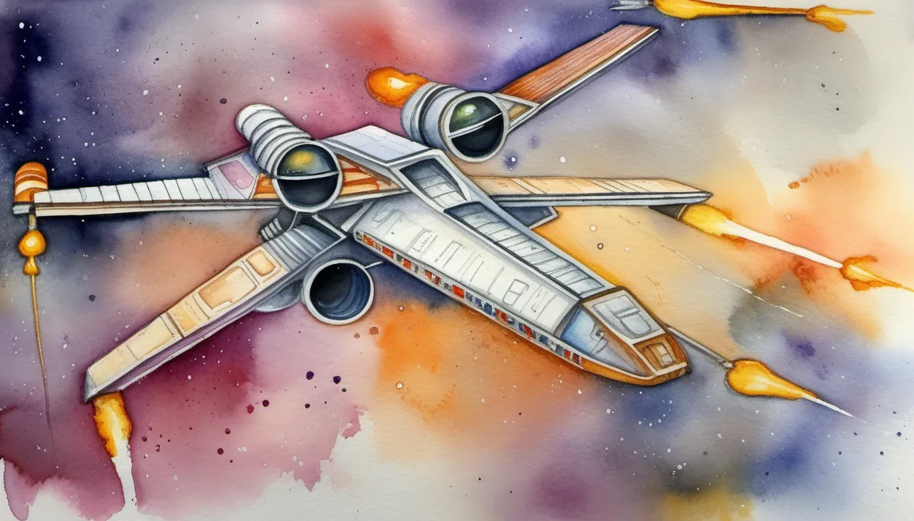<br>
      <p>Watercolor</p>
    </td>
  </tr>
</table>


### JuggernautXL + controlnet (canny)

<div style="text-align: left;">
  
  <p style="text-align: center; width: 1200px;">Original Image</p>
</div>

<table>
  <tr>
    <td align="center">
      <br>
      <p>Fantasy</p>
    </td>
    <td align="center">
      <br>
      <p>Horror</p>
    </td>
  </tr>
  <tr>
    <td align="center">
      <br>
      <p>Lowpoly</p>
    </td>
    <td align="center">
      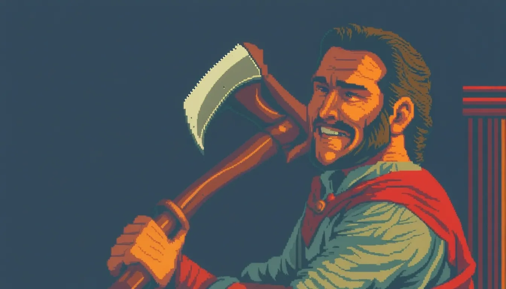<br>
      <p>Pixelart</p>
    </td>
  </tr>
</table>

<div style="text-align: left;">
  
  <p style="text-align: center; width: 1200px;">Original Image</p>
</div>

<table>
  <tr>
    <td align="center">
      <br>
      <p>Fantasy</p>
    </td>
    <td align="center">
      <br>
      <p>Film Noir</p>
    </td>
  </tr>
  <tr>
    <td align="center">
      <br>
      <p>Long Exposure</p>
    </td>
    <td align="center">
      <br>
      <p>Minecraft</p>
    </td>
  </tr>
</table>

### YamerMIX (Unstable Diffusion) + controlnet (depth/canny)

<div style="text-align: left;">
  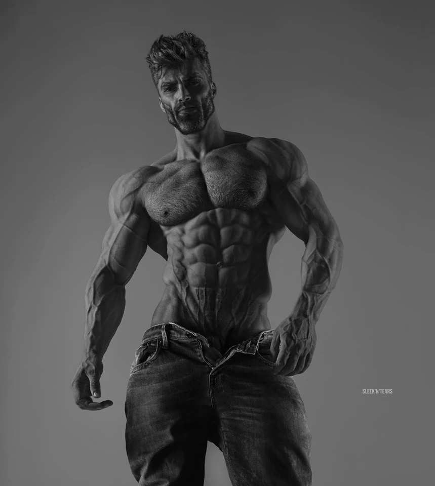
  <p style="text-align: center; width: 1200px;">Original Image</p>
</div>

<table>
  <tr>
    <td align="center">
      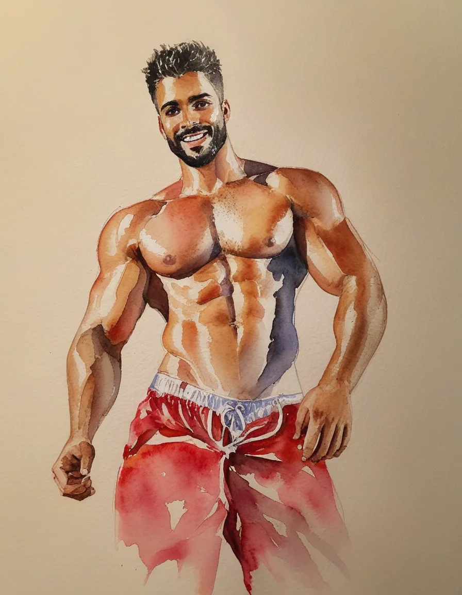<br>
      <p>Watercolor</p>
    </td>
    <td align="center">
      <br>
      <p>Cyberpunk</p>
    </td>
  </tr>
  <tr>
    <td align="center">
      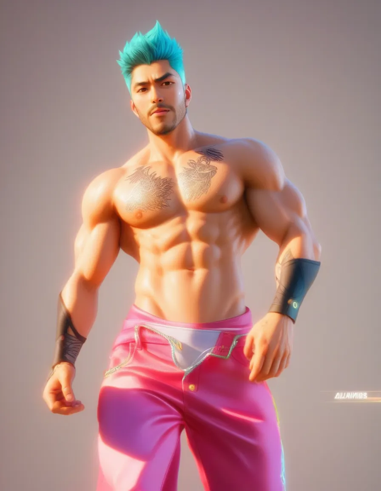<br>
      <p>Anime</p>
    </td>
    <td align="center">
      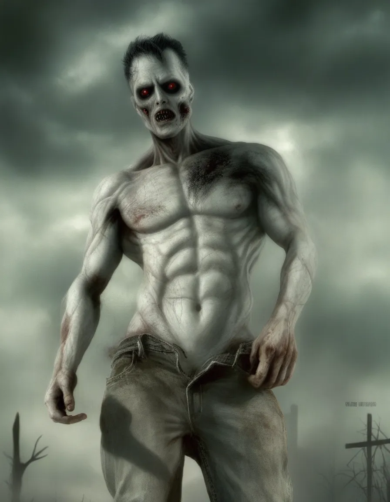<br>
      <p>Horror</p>
    </td>
  </tr>
</table>

<div style="text-align: left;">
  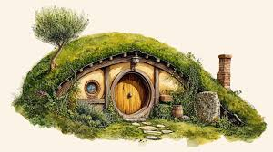
  <p style="text-align: center; width: 1200px;">Original Image</p>
</div>

<table>
  <tr>
    <td align="center">
      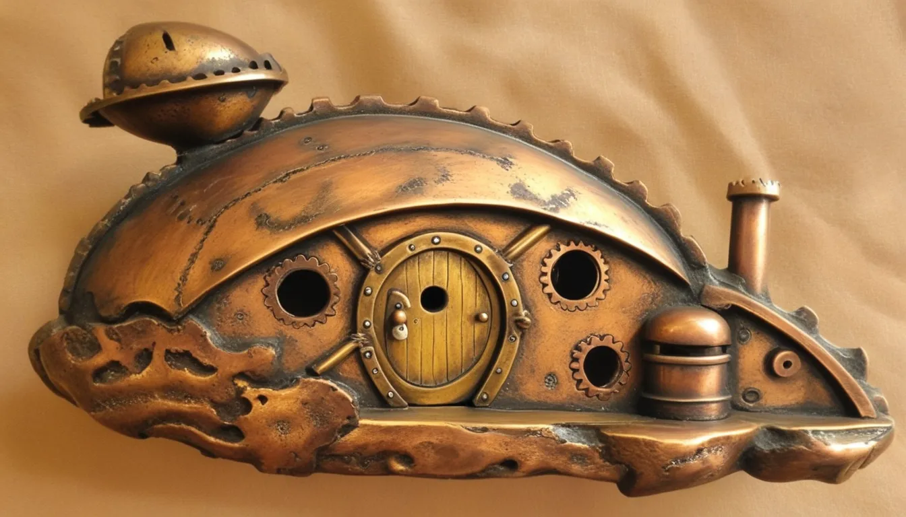<br>
      <p>Steampunk</p>
    </td>
    <td align="center">
      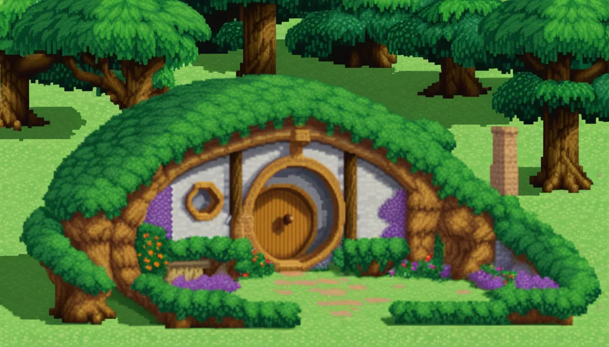<br>
      <p>Pixelart</p>
    </td>
  </tr>
  <tr>
    <td align="center">
      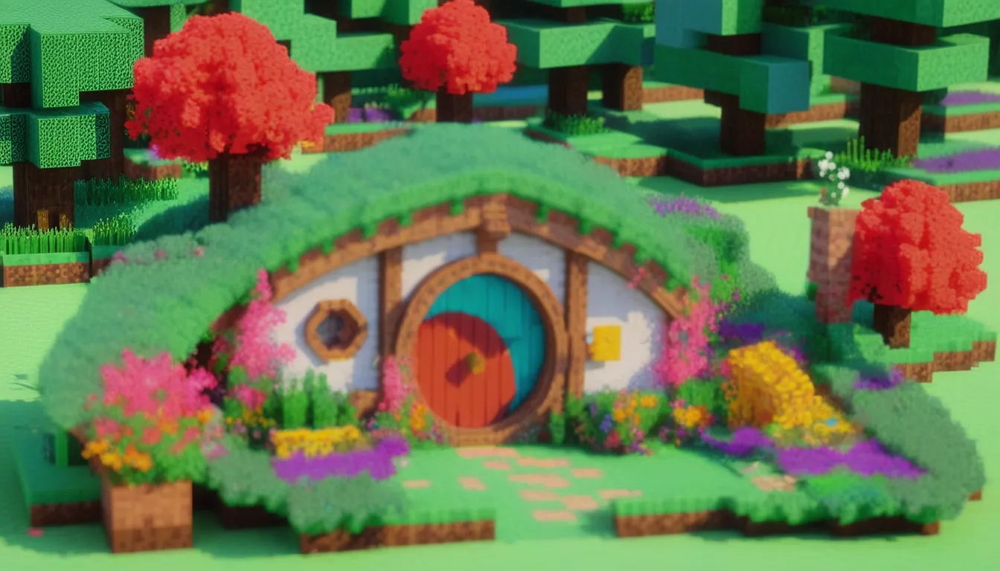<br>
      <p>Minecraft</p>
    </td>
    <td align="center">
      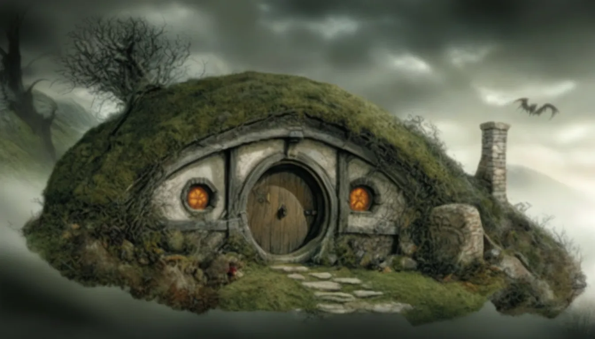<br>
      <p>Horror</p>
    </td>
  </tr>
</table>


## Running the project
As I used the project to prove my abilities in developing applications it will be a lot to download, instead of using API's I decided to show I can handle hosting it as well..

### Option 1. Docker Container
 Due to the extreme size of the docker image (33.7GB) and the GPU compatibilities within running the container, AND the need for docker Nvidia Container Toolkit installed together with CUDA I decided to resign from uploading it.. It works for image generation inference and style transfer using Canny, but there are some unresolved issues with Depth estimation preprocessor (only in the container version)... (TODO)

### Option 2. Running Locally:

  1. Download the codebase:
     ```bash
     git clone https://github.com/Lorakszak/img_gen_project
     ```


  2. CD into the root directory of the project:
     ```bash
     cd img_gen_project/  
     ```


  3. Create Python 3.10 environment either using conda on venv (!MAKE SURE IT's PYTHON 3.10)
       - Using conda:
     ```bash
     conda create --name=heavy_env python=3.10
     conda activate heavy_env
     # Make sure you have the correct environment active
     which python && which pip
     ```

       - Using venv (on Linux/MacOS):
      ```bash
      python3.10 -m venv myenv
      source myenv/bin/activate
      # Make sure you have the correct environment active
      which python && which pip
      ```

       - Using venv (on Windows):
      ```bash
      python3.10 -m venv myenv
      myenv\Scripts\activate
      # Make sure you have the correct environment active
      which python && which pip
      ```


  4. Install all the dependencies necessary:
     ```bash
     pip install -r requirements.txt
     ```

  5. Ensure you have the correct directory structure by running these:
     ```bash
     mkdir -p ./assets/SDXL_base_1_0
     mkdir -p ./assets/Juggernaut_XL
     mkdir -p ./assets/YamerMIX
     mkdir -p ./assets/Controlnets/canny_XL
     mkdir -p ./assets/Controlnets/depth_XL
     ```

  6. Download the models:
This step involves downloading various models (I hope you have a fast internet) and saving them to their respective directories in the ./assets folder. Each command fetches a model from an online source (such as Hugging Face or Civitai) and saves it locally with a specified name. The models include:
   - SDXL base 1.0
   - JuggernautXL Rundiffusionphoto2
   - YamerMIX
   - Controlnet Canny
   - Controlnet Depth
  
   ```bash
     curl -L -o ./assets/SDXL_base_1_0/model.safetensors https://huggingface.co/stabilityai/stable-diffusion-xl-base-1.0/resolve/main/sd_xl_base_1.0.safetensors?download=true && \
     curl -L -o ./assets/Juggernaut_XL/juggernautXL_v9Rundiffusionphoto2.safetensors https://civitai.com/api/download/models/348913?type=Model&format=SafeTensor&size=full&fp=fp16 && \
     curl -L -o ./assets/YamerMIX/sdxlUnstableDiffusers_nihilmania.safetensors https://civitai.com/api/download/models/395107?type=Model&format=SafeTensor&size=pruned&fp=fp16 && \
     curl -L -o ./assets/Controlnets/canny_XL/diffusion_pytorch_model.fp16.safetensors https://huggingface.co/diffusers/controlnet-canny-sdxl-1.0/resolve/main/diffusion_pytorch_model.fp16.safetensors?download=true && \
     curl -L -o ./assets/Controlnets/depth_XL/diffusion_pytorch_model.fp16.safetensors https://huggingface.co/diffusers/controlnet-depth-sdxl-1.0/resolve/main/diffusion_pytorch_model.fp16.safetensors?download=true
   ```


  7. Run the App by:
     ```bash
     python main.py
     ```


  8. From the same device go to the link: `https://0.0.0.0:7860`

  (+) Alternatively if you want to see more output through the terminal change the 
    `DEBUG = os.environ.get("DEBUG", "False").lower() == "true"` to 
    `DEBUG = os.environ.get("DEBUG", "True").lower() == "true"` in the `./config.py` file.
    
  Then the app will run on your localhost and will be accessible at `http://127.0.0.1:7860`
