# SimpleGen

Image style transfer application using Stable Diffusion XL with ControlNet conditioning. Runs fully locally - no external API dependencies.

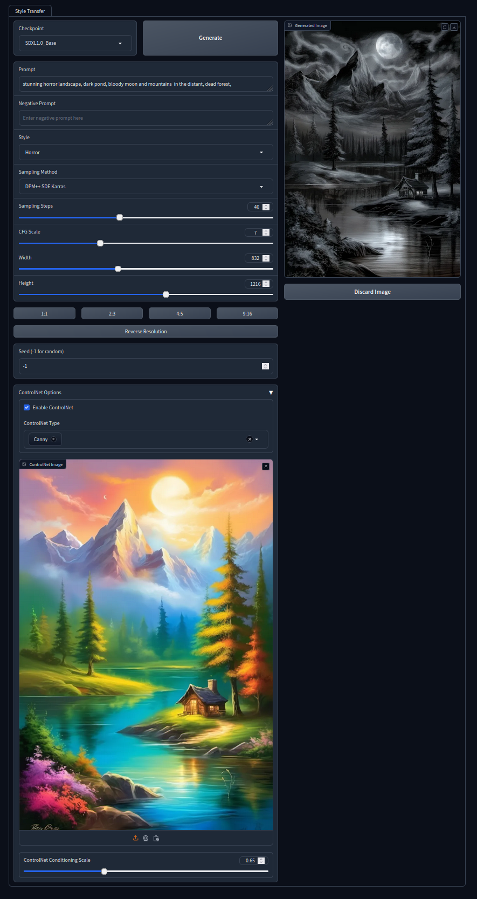

## Built With

- **Stable Diffusion XL** - image generation backbone (SDXL 1.0 Base, JuggernautXL, YamerMIX)
- **ControlNet** - structural conditioning via Canny edge detection and depth estimation
- **Gradio** - web-based GUI
- **PyTorch** - deep learning framework
- **Docker** - containerization (experimental)

## Table of Contents
- [SimpleGen](#simplegen)
  - [Built With](#built-with)
  - [Table of Contents](#table-of-contents)
  - [Features](#features)
  - [Showcase](#showcase)
    - [Stable Diffusion XL 1.0 Base + controlnet (depth)](#stable-diffusion-xl-10-base--controlnet-depth)
    - [JuggernautXL + controlnet (canny)](#juggernautxl--controlnet-canny)
    - [YamerMIX (Unstable Diffusion) + controlnet (depth/canny)](#yamermix-unstable-diffusion--controlnet-depthcanny)
  - [Limitations](#limitations)
  - [Possible Improvements](#possible-improvements)
  - [Prerequisites](#prerequisites)
  - [Running the project](#running-the-project)
    - [Option 1. Docker Container (NOT SUPPORTED)](#option-1-docker-container-not-supported)
    - [Option 2. Running Locally (Tested on RTX4090):](#option-2-running-locally-tested-on-rtx4090)


## Features
- Apply artistic styles (Watercolor, Film Noir, Cyberpunk, Anime, Pixelart, and more) to any input image
- 3 model checkpoints with different generation characteristics
- Dual ControlNet support (Canny + Depth) for fine-grained structural control
- Configurable generation parameters (sampling method, steps, CFG scale, resolution, seed)
- Self-contained - all inference runs on your local GPU, no cloud APIs needed


## Limitations
 - GPU required - CPU-only inference is not supported (float16 precision, and generation would take hours regardless)
 - ControlNet style transfer works best when the output aspect ratio is similar to the input, otherwise cropping is applied
 - Requires 10-14GB of VRAM for dual ControlNet inference at the default 1024x1024 resolution


## Possible Improvements
 - Per-model ControlNet conditioning scales, separate condition images, multi-image conditioning
 - ControlNet scheduling (e.g. apply conditioning for the first 80% of steps, then pure diffusion for refinement)
 - Additional ControlNet types (OpenPose, etc.) and more Canny preprocessor options
 - Generation metadata embedded in output images for reproducibility
 - Automatic aspect ratio handling for conditioning images (padding/stretching instead of cropping)
 - Avatar generation via IP-Adapter, Instant-ID, or LoRA fine-tuning
 - Video conditioning using Live Portrait
 - Post-processing pipelines: upscaling, detailing, and refining
 - Production architecture: separate GUI, API gateway, and pipeline hosting for independent scaling


## Showcase
Style transfer examples grouped by checkpoint - all outputs can be found in `Examples/`.

### Stable Diffusion XL 1.0 Base + controlnet (depth)

<div style="text-align: left;">
  
  <p style="text-align: center; width: 1200px;">Original Image</p>
</div>

<table>
  <tr>
    <td align="center">
      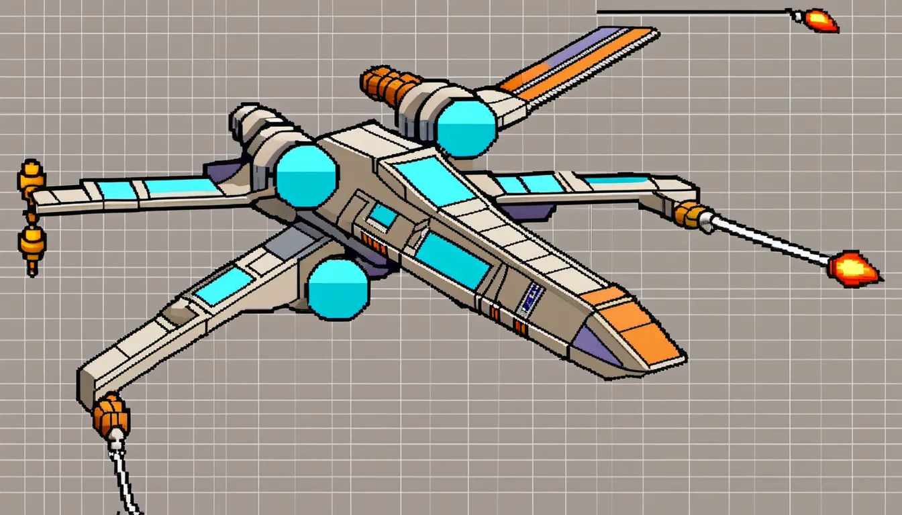<br>
      <p>Pixelart</p>
    </td>
    <td align="center">
      <br>
      <p>Steampunk</p>
    </td>
  </tr>
  <tr>
    <td align="center">
      <br>
      <p>Lowpoly</p>
    </td>
    <td align="center">
      <br>
      <p>Watercolor</p>
    </td>
  </tr>
</table>


### JuggernautXL + controlnet (canny)

<div style="text-align: left;">
  
  <p style="text-align: center; width: 1200px;">Original Image</p>
</div>

<table>
  <tr>
    <td align="center">
      <br>
      <p>Fantasy</p>
    </td>
    <td align="center">
      <br>
      <p>Horror</p>
    </td>
  </tr>
  <tr>
    <td align="center">
      <br>
      <p>Lowpoly</p>
    </td>
    <td align="center">
      <br>
      <p>Pixelart</p>
    </td>
  </tr>
</table>

<div style="text-align: left;">
  
  <p style="text-align: center; width: 1200px;">Original Image</p>
</div>

<table>
  <tr>
    <td align="center">
      <br>
      <p>Fantasy</p>
    </td>
    <td align="center">
      <br>
      <p>Film Noir</p>
    </td>
  </tr>
  <tr>
    <td align="center">
      <br>
      <p>Long Exposure</p>
    </td>
    <td align="center">
      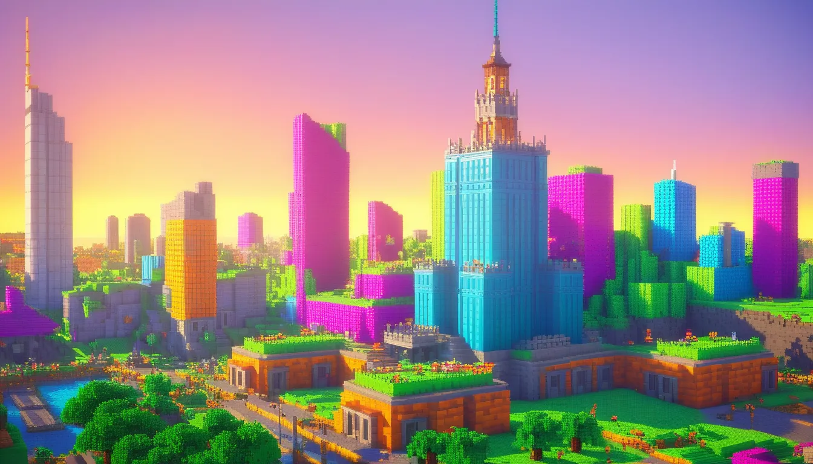<br>
      <p>Minecraft</p>
    </td>
  </tr>
</table>

### YamerMIX (Unstable Diffusion) + controlnet (depth/canny)

<div style="text-align: left;">
  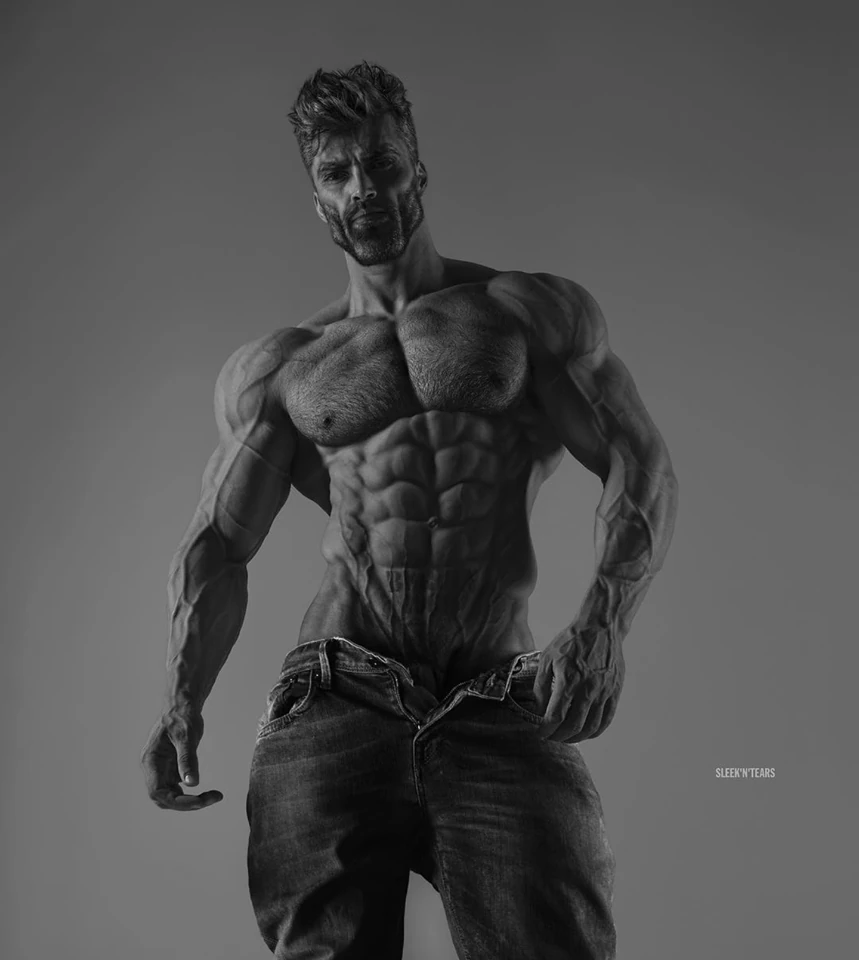
  <p style="text-align: center; width: 1200px;">Original Image</p>
</div>

<table>
  <tr>
    <td align="center">
      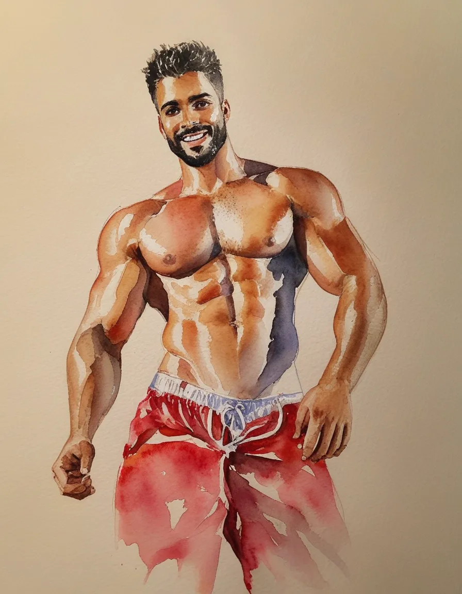<br>
      <p>Watercolor</p>
    </td>
    <td align="center">
      <br>
      <p>Cyberpunk</p>
    </td>
  </tr>
  <tr>
    <td align="center">
      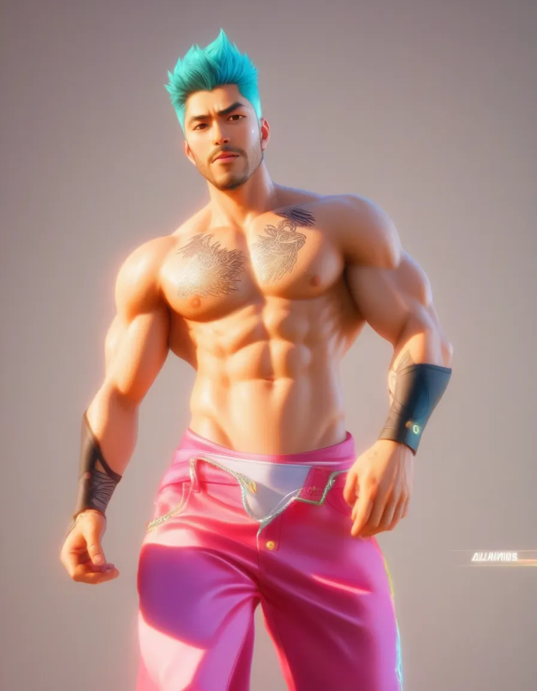<br>
      <p>Anime</p>
    </td>
    <td align="center">
      <br>
      <p>Horror</p>
    </td>
  </tr>
</table>

<div style="text-align: left;">
  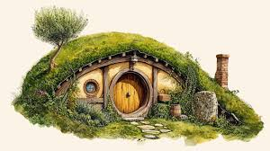
  <p style="text-align: center; width: 1200px;">Original Image</p>
</div>

<table>
  <tr>
    <td align="center">
      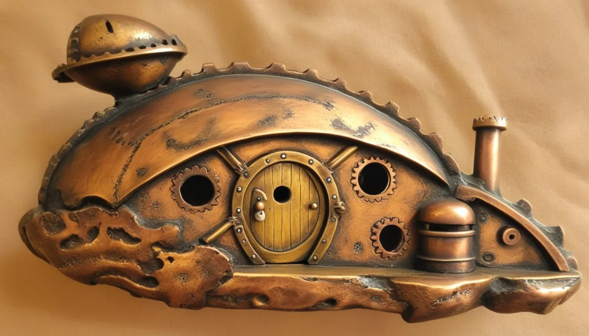<br>
      <p>Steampunk</p>
    </td>
    <td align="center">
      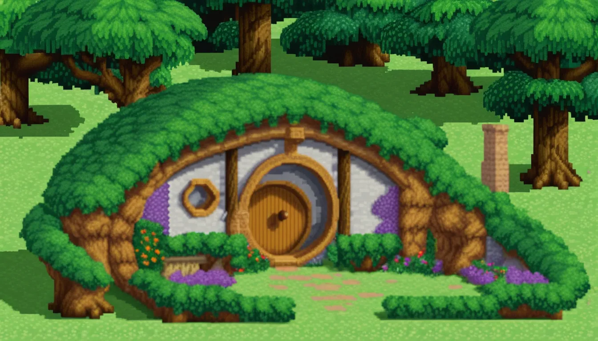<br>
      <p>Pixelart</p>
    </td>
  </tr>
  <tr>
    <td align="center">
      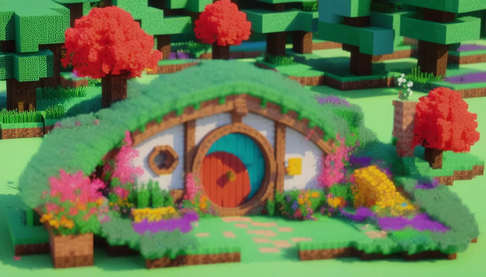<br>
      <p>Minecraft</p>
    </td>
    <td align="center">
      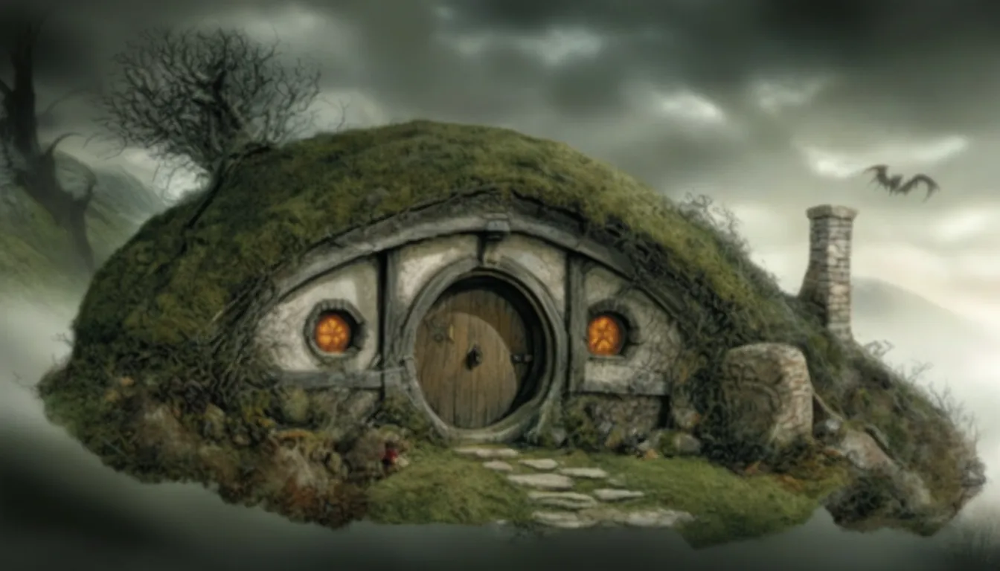<br>
      <p>Horror</p>
    </td>
  </tr>
</table>

Additional Images and GenAI projects I took part in can be found on my [Google Drive Portfolio](https://drive.google.com/drive/u/0/folders/1d7hiyd0rEAWHNBJOwgtBDqmGfEUG3tce) if you're interested to see what I can do.


## Prerequisites
 - Nvidia GPU card with at least 12GB of VRAM
 - Nvidia CUDA installed -> [installing](https://developer.nvidia.com/cuda-downloads)


## Running the project
All inference runs locally - model weights (~15GB total) need to be downloaded before first use.


### Option 1. Docker Container (NOT SUPPORTED)
A Dockerfile is included but not fully supported. The image is ~33.7GB and requires the NVIDIA Container Toolkit with CUDA. Canny-based style transfer works in the container, but depth estimation has unresolved issues in the containerized environment.


### Option 2. Running Locally (Tested on RTX4090):

  1. Download the codebase:
     ```bash
     git clone https://github.com/Lorakszak/img_gen_project
     ```


  2. CD into the root directory of the project:
     ```bash
     cd img_gen_project/  
     ```


  3. Create Python 3.10 environment either using conda on venv (!MAKE SURE IT's PYTHON 3.10)
       - Using conda:
     ```bash
     conda create --name=heavy_env python=3.10
     conda activate heavy_env
     # Make sure you have the correct environment active
     which python && which pip
     ```

       - Using venv (on Linux/MacOS):
      ```bash
      python3.10 -m venv myenv
      source myenv/bin/activate
      # Make sure you have the correct environment active
      which python && which pip
      ```

       - Using venv (on Windows):
      ```bash
      python3.10 -m venv myenv
      myenv\Scripts\activate
      # Make sure you have the correct environment active
      which python && which pip
      ```


  4. Install all the dependencies necessary:
     ```bash
     pip install -r requirements.txt
     ```

  5. Ensure you have the correct directory structure by running these:
     ```bash
     mkdir -p ./assets/SDXL_base_1_0
     mkdir -p ./assets/Juggernaut_XL
     mkdir -p ./assets/YamerMIX
     mkdir -p ./assets/Controlnets/canny_XL
     mkdir -p ./assets/Controlnets/depth_XL
     ```

  6. Download the models (~15GB total from Hugging Face and Civitai):
   - SDXL base 1.0
   - JuggernautXL Rundiffusionphoto2
   - YamerMIX
   - Controlnet Canny
   - Controlnet Depth
  
   ```bash
     curl -L -o ./assets/SDXL_base_1_0/model.safetensors https://huggingface.co/stabilityai/stable-diffusion-xl-base-1.0/resolve/main/sd_xl_base_1.0.safetensors?download=true && \
     curl -L -o ./assets/Juggernaut_XL/juggernautXL_v9Rundiffusionphoto2.safetensors https://civitai.com/api/download/models/348913?type=Model&format=SafeTensor&size=full&fp=fp16 && \
     curl -L -o ./assets/YamerMIX/sdxlUnstableDiffusers_nihilmania.safetensors https://civitai.com/api/download/models/395107?type=Model&format=SafeTensor&size=pruned&fp=fp16 && \
     curl -L -o ./assets/Controlnets/canny_XL/diffusion_pytorch_model.fp16.safetensors https://huggingface.co/diffusers/controlnet-canny-sdxl-1.0/resolve/main/diffusion_pytorch_model.fp16.safetensors?download=true && \
     curl -L -o ./assets/Controlnets/depth_XL/diffusion_pytorch_model.fp16.safetensors https://huggingface.co/diffusers/controlnet-depth-sdxl-1.0/resolve/main/diffusion_pytorch_model.fp16.safetensors?download=true
   ```


  7. Run the App by:
     ```bash
     python main.py
     ```


  8. From the same device go to the link: `https://0.0.0.0:7860`

  (+) For verbose logging, set the `DEBUG` environment variable:
      ```bash
      DEBUG=true python main.py
      ```
      The app will then be accessible at `http://127.0.0.1:7860`.
